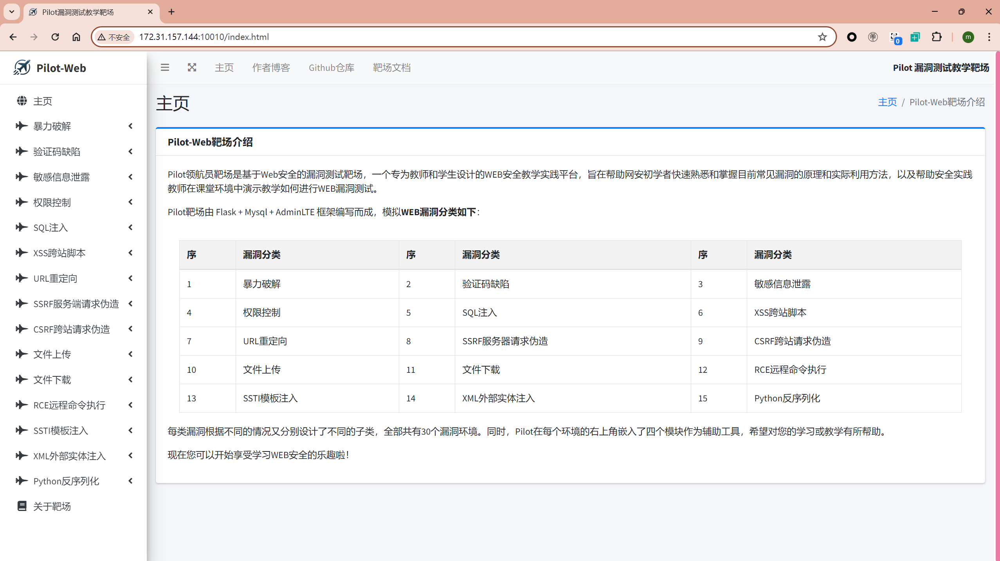
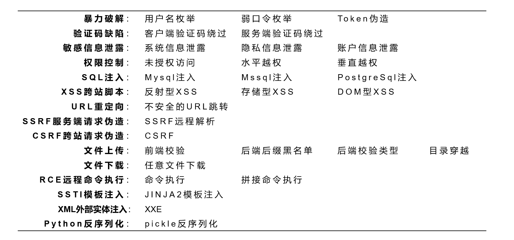
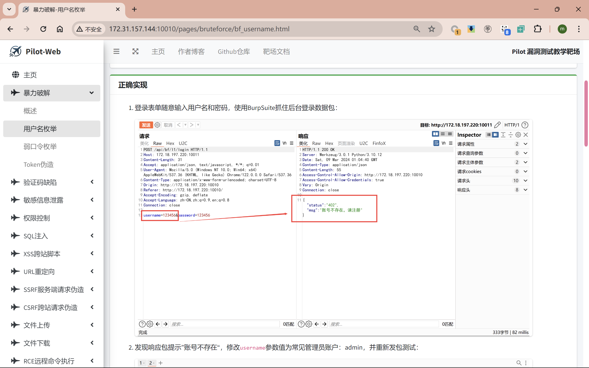
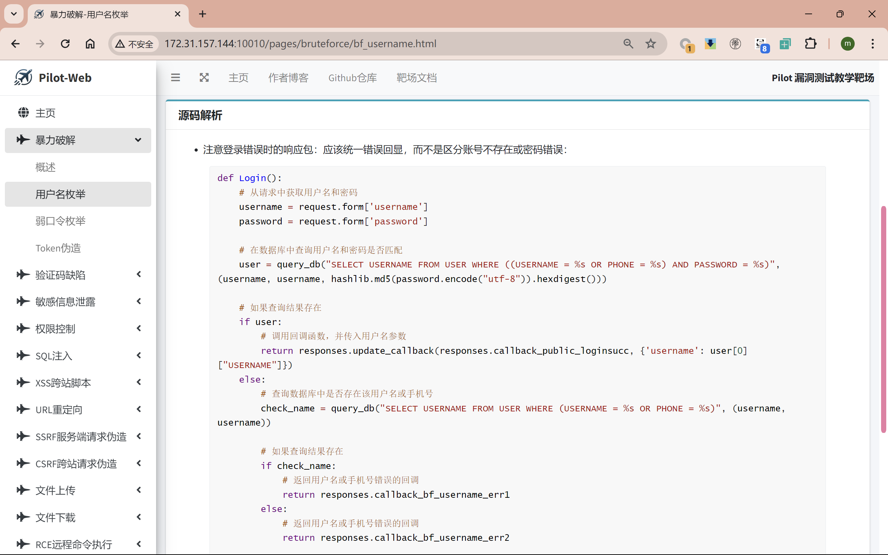
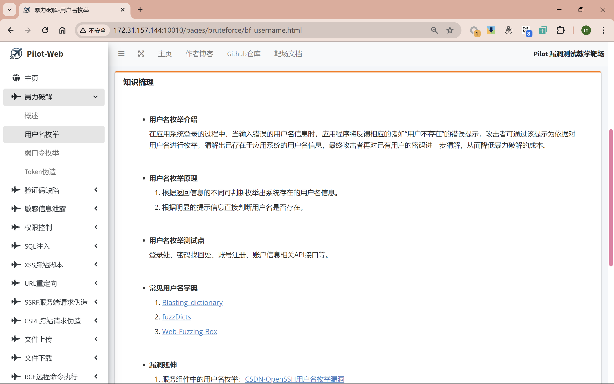
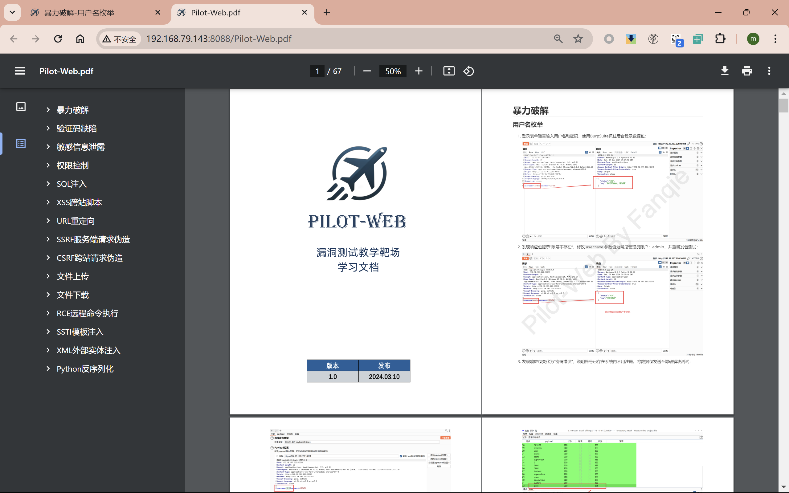
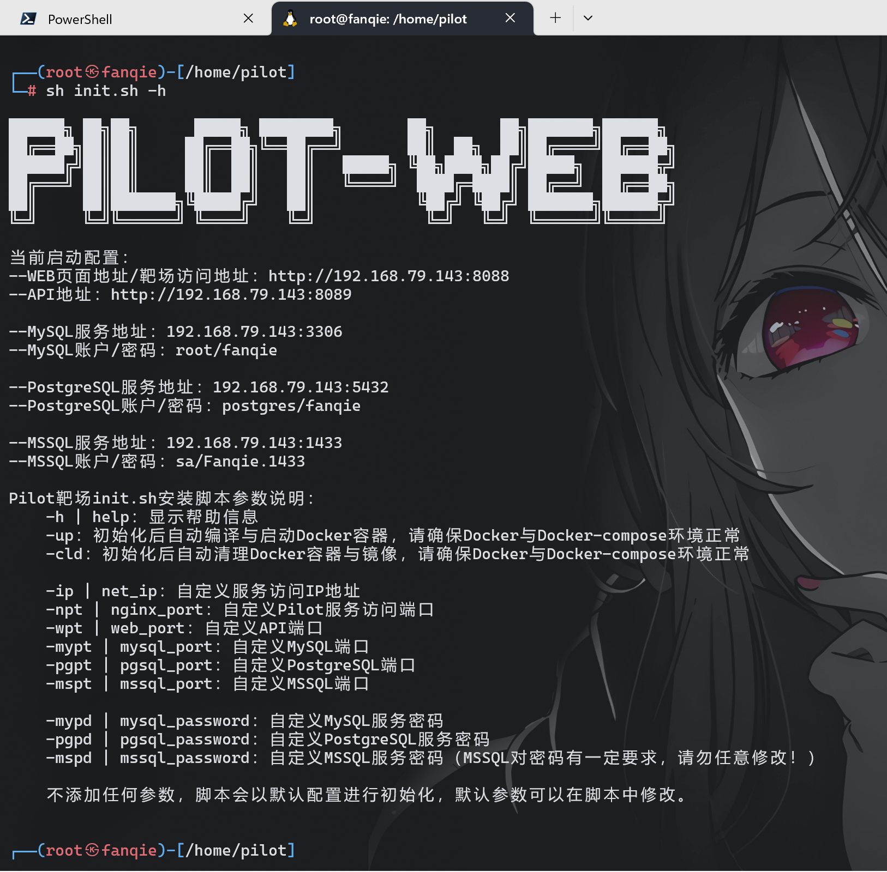

<h1 align="center">
Pilot漏洞测试教学靶场
</h1>

<p align="center">


</p>

<p align="center">
<a href="https://github.com/2740908911/Pilot-Web">中文文档</a>
<a href="https://github.com/2740908911/Pilot-Web/blob/main/README_EN.md">English documentation</a>
</p>

Pilot领航员靶场是基于Web安全的漏洞测试靶场，一个专为教师和学生设计的WEB安全教学实践平台，旨在帮助网安初学者快速熟悉和掌握目前常见漏洞的原理和实际利用方法，以及帮助安全实践教师在课堂环境中演示教学如何进行WEB漏洞测试。

Pilot靶场由 Flask + Mysql + AdminLTE 框架编写而成，模拟**WEB漏洞分类如下**：

| 序   | 漏洞分类     | 序   | 漏洞分类           | 序   | 漏洞分类         |
| ---- | ------------ | ---- | ------------------ | ---- | ---------------- |
| 1    | 暴力破解     | 2    | 验证码缺陷         | 3    | 敏感信息泄露     |
| 4    | 权限控制     | 5    | SQL注入            | 6    | XSS跨站脚本      |
| 7    | URL重定向    | 8    | SSRF服务器请求伪造 | 9    | CSRF跨站请求伪造 |
| 10   | 文件上传     | 11   | 文件下载           | 12   | RCE远程命令执行  |
| 13   | SSTI模板注入 | 14   | XML外部实体注入    | 15   | Python反序列化   |

每类漏洞根据不同的情况又分别设计了不同的子类，全部共有30个漏洞环境。同时，Pilot在每个环境的右上角嵌入了四个模块作为辅助工具，希望对您的学习或教学有所帮助。

---

## 为什么使用Pilot

* 少数**Python环境**的开源WEB漏洞靶场
* 唯一**集成知识库、漏洞学习文档和源码解析等功能**的开源综合型教学靶场
* 对比同类产品**更全面的漏洞类型**
* 更**简单的部署**方式和更**方便的配置管理**方式
* 全新的**UI设计**，更近现代靶场设计
* ……

---

## 主页展示



---

## 全部漏洞环境



---

## 全面的辅助教学功能与漏洞文档

* 思路提示：常规功能，略

* 正确实现：

  

* 源码解析：

  

* 知识梳理：

  

* 漏洞文档：

  

---

## 更简单的部署方式（安装和使用）

> 前置条件：Linux系统虚拟机，确保已安装 Docker + Docker-Compose，网络正常。

Pilot漏洞测试教学靶场采用Docker+Docker-Compose技术封装，通过快速部署脚本init.sh进行配置管理和快速部署，部署过程中请使用高权限账户（例如root权限）进行操作。

1. 通过clone或[releases](https://github.com/2740908911/Pilot-Web/releases/)下载最新的Pilot靶场源码，并解压至部署目录。

2. 通过ifconfig命令查看出网IP地址。

3. 在Pilot项目目录中，为快速部署脚本init.sh赋予执行权限：

   ```shell
   sudo chmod +x ./init.sh
   ```

4. 自动化部署Pilot靶场，此过程需要联网进行：

   ```shell
   sh init.sh -ip=xxx.xxx.xxx.xxx -up
   ```

5. **等待下载与部署完成，开始您的WEB安全学习之旅！**

6. 更多的使用方式通过下面这条命令查看，例如对靶场端口、靶场数据库服务的配置。当您遇到服务端口冲突时可以修改配置以进行服务部署：

   ```shell
   sh init.sh -h || sh init.sh help
   ```

   

---

## 部署示例与教程

**BiliBili地址：** https://www.bilibili.com/video/BV1b142127PJ/

<!--**图片演示：** 时间较长，可以根据部署视频进行部署-->

<!---->

---

## 安全须知

**Pilot漏洞靶场极其容易受到攻击！**

请勿将其部署到您的云服务器或任何面向互联网的服务器上，这样将导致您的服务器被攻破。Pilot推荐使用虚拟机（如VMware、WSL2），并通过Docker安装Pilot-Web靶场。尽量不要在本机环境直接部署靶场，除非您确认可保证自己的主机安全。

---

## 免责声明

作者不对任何人使用这个应用程序（Pilot靶场）的方式承担责任。在上文作者已经明确了该应用程序的开发目的，Pilot靶场用于安全初学者合法学习和安全教师合法教学，而不是进行非法利用或恶意使用。

作者已发出警告（安全须知）并采取措施，以防止用户将Pilot部署运行在实际的服务器上，如果您的Web服务器因安装Pilot而遭受攻击，则应该由上传/安装部署该靶场的人员负责。

---

## 致谢

作者在开发Pilot漏洞测试教学靶场时，对现有的部分开源靶场功能和内容进行了参考整理，同时对一些开源知识库进行了参考引用，在此表示由衷感谢，其中主要的参考项目有：

1. Pikachu漏洞练习平台：https://github.com/zhuifengshaonianhanlu/pikachu
2. ElectricRat靶场：https://github.com/linjiananallnt/ElectricRat
3. DVWA漏洞靶场：https://github.com/digininja/DVWA
4. D4M1TS知识库：https://blog.gm7.org/
5. 网络安全-自学笔记：http://t.csdnimg.cn/GXYeq

互联网WEB安全的发展离不开这些安全人员的无私奉献，希望本项目也能向领航员一样，引领更多的安全初学者步入新世界！

---

## 其他

作者博客：[FanqieのBlog](https://f4nq1e.com/)

有问题请提交ISSUES，项目求**Star**！！！！

如果Pilot对您有帮助，可以打赏作者[一杯奶茶](https://reward.f4nq1e.com/)喔~

转载请注明作者Fanqie与github地址，谢谢！
