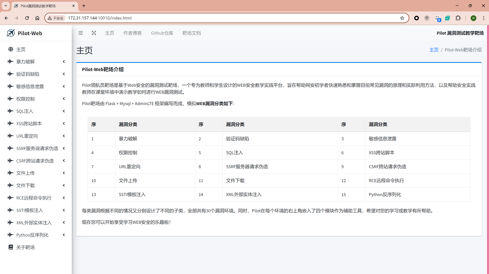
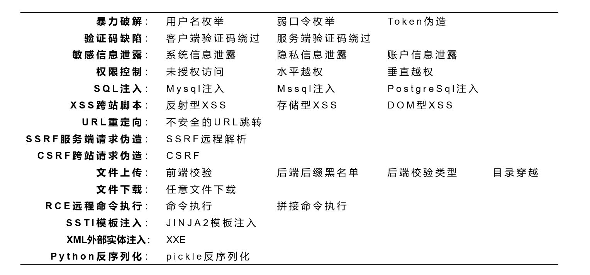
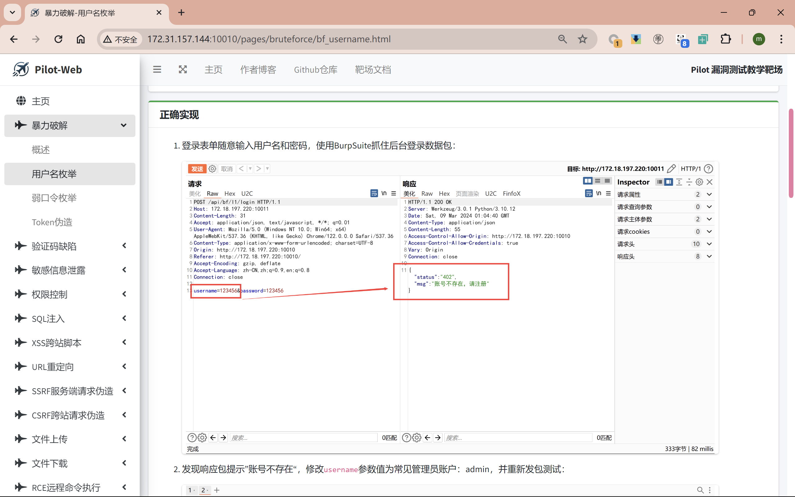
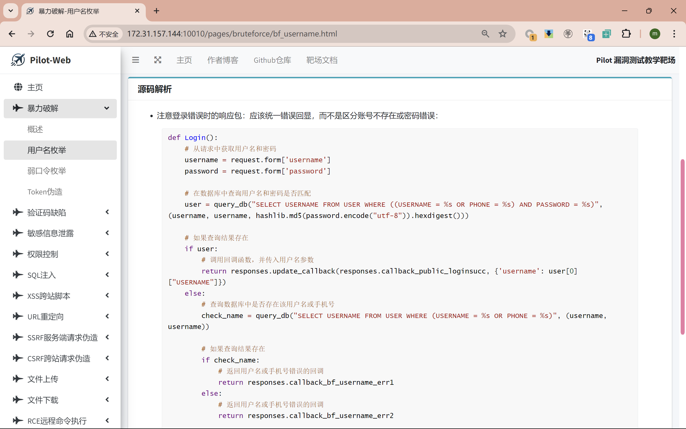
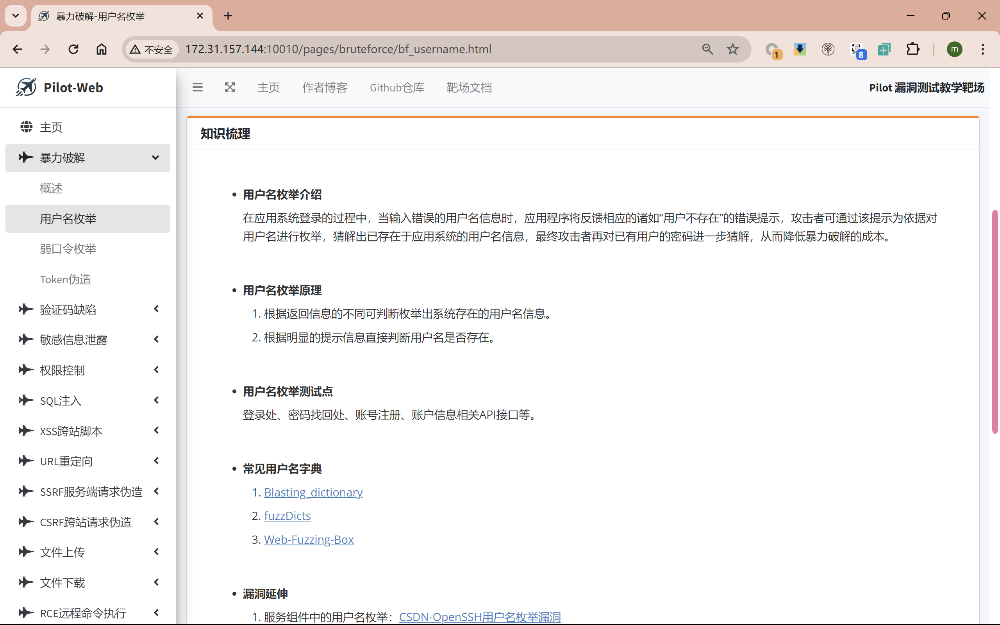

<h1 align="center">
Pilot Vulnerability Testing Teaching Range
</h1>

<p align="center">


<p>


Pilot Range is a Web security-based vulnerability testing range, a WEB security teaching practice platform designed for teachers and students, designed to help beginners to quickly familiarize themselves with the principles of common vulnerabilities and practical methods of exploitation, as well as to help security practice teachers in the classroom environment to demonstrate how to teach how to conduct WEB vulnerability testing.

The Pilot Range is written in the Flask + Mysql + AdminLTE framework and simulates **WEB vulnerabilities categorized **:

| No.  | Vulnerability Category | No.  | Vulnerability Category | No.  | Vulnerability Category |
| ---- | ---------------------- | ---- | ---------------------- | ---- | ---------------------- |
| 1    | brute force            | 2    | CAPTCHA Flaw           | 3    | information leak       |
| 4    | authority control      | 5    | SQL injection          | 6    | XSS                    |
| 7    | URL redirect           | 8    | SSRF                   | 9    | CSRF                   |
| 10   | File Uploads           | 11   | File Downloads         | 12   | RCE                    |
| 13   | SSTI                   | 14   | XXE                    | 15   | Python Unserialize     |

Each type of vulnerability is designed with different sub-categories according to different situations, and there are 30 vulnerability environments in total. At the same time, Pilot has embedded four modules in the upper right corner of each environment as auxiliary tools, hoping to help you learn or teach.

---

## Why use Pilot

* Few **Python environment** open source WEB vulnerability range
* The only **integrated knowledge base, vulnerability learning documents and source code analysis and other functions** of the open source comprehensive teaching range
* **More comprehensive types of vulnerabilities** than comparable products
* A simpler way to deploy** and a more **easy way to manage** the configuration
* New **UI design**, closer to modern range design
* ……

---

## Home Page Showcase



---

## All Vulnerable Environments



---

## Comprehensive documentation of teaching aids and vulnerabilities

* Thought Hint: Regular Features, Omitted

* Correctly realized:

  

* Source code parsing:

  

* Knowledge combing:

  

* Vulnerability Documentation:

  

---

## Easier deployment (installation and use)

> Prerequisites: Linux system VM, make sure Docker + Docker-Compose is installed and the network is working.

Pilot vulnerability testing teaching range using Docker + Docker-Compose technology package, through the rapid deployment script init.sh configuration management and rapid deployment, the deployment process, please use high-privilege accounts (such as root privileges) to operate.

1. Download the latest Pilot range source code via clone or [releases](https://github.com/2740908911/Pilot-Web/releases/) and extract it to the deployment directory.

2. View the outgoing IP address via the ifconfig command.

3. In the Pilot project directory, give execute permission to the rapid deployment script init.sh:

   ```shell
   sudo chmod +x ./init.sh
   ```

4. Automate the deployment of Pilot ranges, a process that requires networking:

   ```shell
   sh init.sh -ip=xxx.xxx.xxx.xxx -up
   ```

5. **Wait for the download and deployment to complete and start your WEB SECURITY learning journey! **

6. More usage is viewed by this command below, such as configuration of the range port, range database service. You can modify the configuration for service deployment when you encounter service port conflicts:

   ```shell
   sh init.sh -h || sh init.sh help
   ```

   

---

## Deployment Examples and Tutorials

**BiliBili Location：** https://www.bilibili.com/video/BV1b142127PJ/

---

## Safety Instructions

**The Pilot Exploit Range is extremely vulnerable to attack! **

Do not deploy it to your cloud servers or any Internet-facing servers, as this will result in your server being compromised.Pilot recommends using a virtual machine (e.g. VMware, WSL2) and installing the Pilot-Web range via Docker. Try not to deploy the range directly in your local environment unless you are sure you can secure your hosting.

---

## Statement denying or limiting responsibility

The author is not responsible for the way anyone uses this application (Pilot Range). In the above the author has made clear the purpose for which this application was developed, Pilot Range is used for legitimate learning by safety beginners and legitimate teaching by safety teachers, and not for illegal exploitation or malicious use.

The authors have issued warnings (Safety Instructions) and taken steps to prevent users from running Pilot deployments on actual servers, and if your web server is attacked as a result of installing Pilot, it should be the responsibility of the person uploading/installing the deployment of the range.

---

## Acknowledgements

The authors in the development of Pilot vulnerability testing teaching range, some of the existing open-source range of functions and content for reference to organize, at the same time, some of the open-source knowledge base reference references, I would like to express my heartfelt thanks, which the main reference projects are:

1. Pikachu Vulnerability Exercise Platform：https://github.com/zhuifengshaonianhanlu/pikachu
2. ElectricRat Range：https://github.com/linjiananallnt/ElectricRat
3. DVWA：https://github.com/digininja/DVWA
4. D4M1TS Knowledge Base：https://blog.gm7.org/
5. Network Security - Self-Study Notes：http://t.csdnimg.cn/GXYeq

The development of Internet WEB security can not be separated from the selfless dedication of these security personnel, I hope that this project can also be the same as the navigator to lead more security beginners into the new world!

---

## Others

Author's Blog: [FanqieのBlog](https://f4nq1e.com/)

Please submit ISSUES if you have questions, the program begs **Star** ！！！！

If Pilot is helpful to you, you can reward the author [a cup of milk tea](https://reward.f4nq1e.com/) Whoo~!
